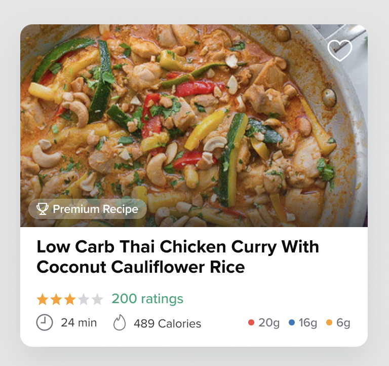
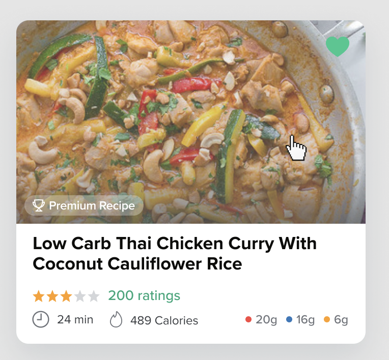
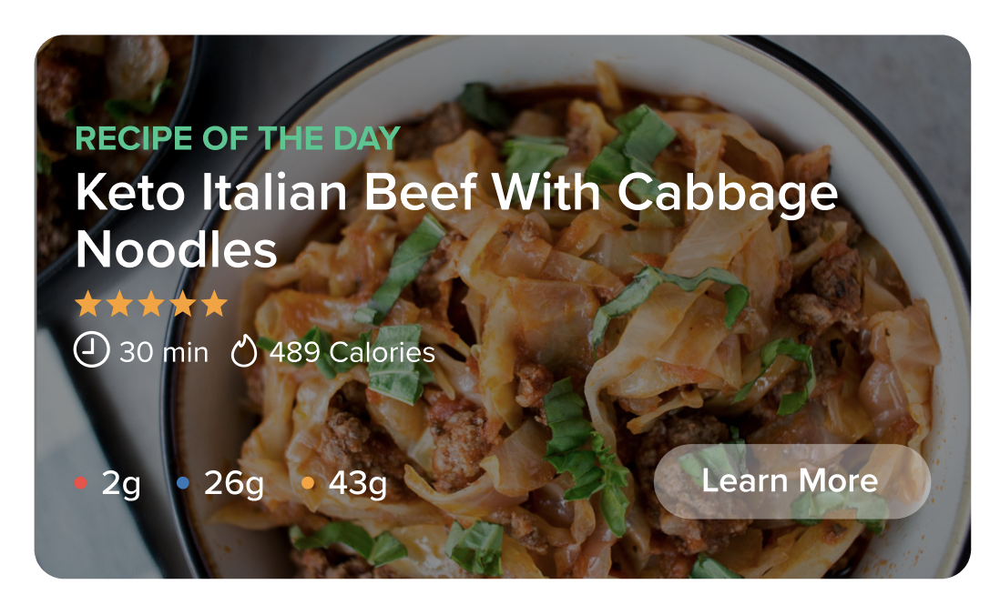

# Carb Manager Challenge

This project was based on the following Figma design:

## Design

**Card:**



**Hover:**

20% opacity white fill when hovering over the card.



**Figma Link:**

[https://www.figma.com/file/Hv0bOihxG5M40ASYsFBrVR/Interview-Assignment?node-id=0%3A1](https://www.figma.com/file/Hv0bOihxG5M40ASYsFBrVR/Interview-Assignment?node-id=0%3A1)

You can check the other provided instructions in [this file](INSTRUCTIONS.md).

---

## How to start:

To start, you will need to run the following command to install all the necessary project dependencies:

```
yarn install
```

Whenever you are ready to start the server and the app, run the following command:

```
yarn serve
```

To be able to run the tests, you will need to run the following command:

```
yarn test
```

---

## Future improvements:

- The PremiumCardRecipe component should receive a prop called `isFavorite` and render a filled heart if it is true. Unfortunalelly, the server does not provide this information yet.

- The PremiumCardRecipe should also be able to display different variations depending on the `variation` prop. For example, if the we want to display a 'Recipe of the Day' card `variation`, like the image below, we would be able to reuse a lot of the code from the PremiumCardRecipe component, passing variable props to the Styled Components elements and then modifying CSS attributes.


